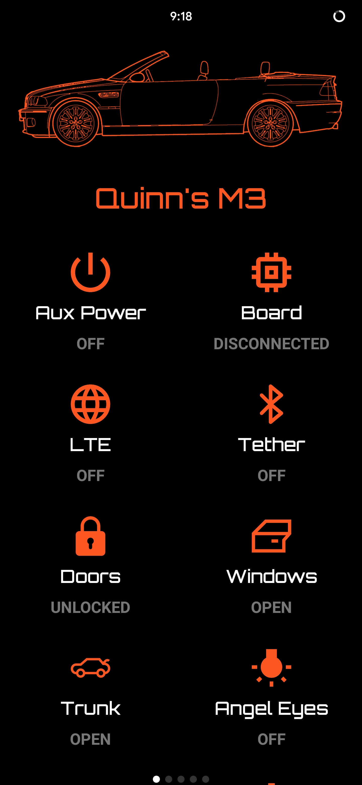
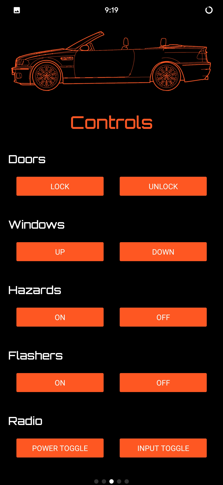
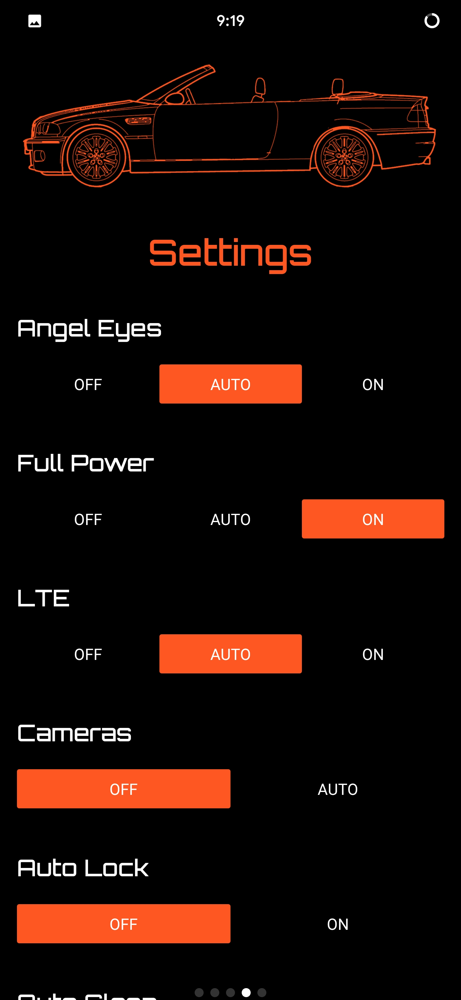
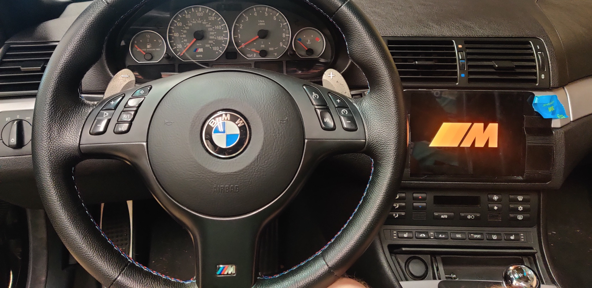
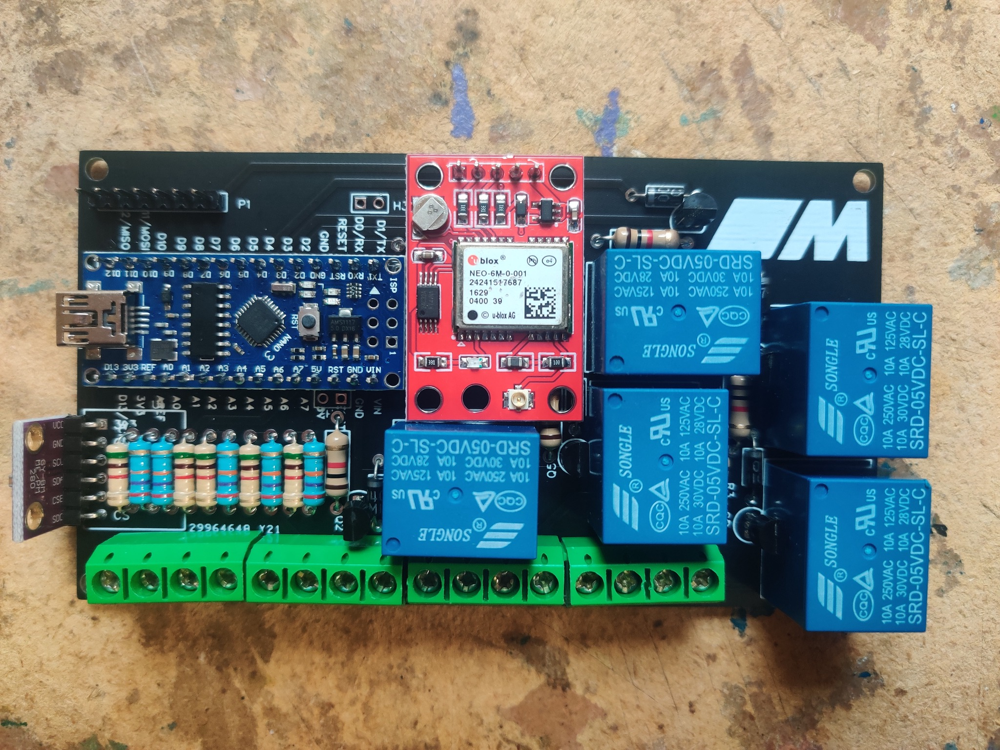
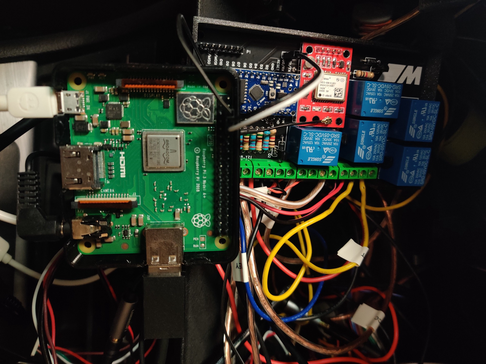

# BMW Control Center

An embedded computer, an Arduino PCB, and an Android tablet walk into a ~~bar~~ car...

I am modernizing my 2005 vehicle by adding oodles of connectivity and custom electronics. So far, I've successfully implemented:

- Bluetooth Audio with hotspot tethering
- [Programmable wireless LTE](https://www.twilio.com/iot), pushing state over MQTT
- [Arduino based custom PCB](./demo/PCB.jpg) measuring battery voltages, switching relays, and tracking GPS location
- [K-Bus](http://github.com/qcasey/gokbus), controlling radio/windows/locks/other auxiliaries
- CAN Bus, recording ECU data like speed, RPM, pressure
- Hardwired 4K dash camera with 1TB SSD
- [Prometheus](https://prometheus.io/docs/introduction/overview/) exported on `/metrics` for recording time series data
- IP namespaces and write-on-update state control, limiting wireless data
- Android tablet running a customized build of [LineageOS](https://lineageos.org/)
- 3D printed cases, bezels, and shims
- Android apps providing "Tesla-like" control over all the above

These primary features culminate into an app controlled, privacy preserving, monolith of a smart-car-computer system.

# Stack

It's all primarily written with:

- **Go** API for vehicle state
- **React Native** clients for remote system control
- **C** with PlatformIO + Arduino
- **MQTT** 
- Python for handling exported album artwork 
- Containizered Mosquito and Prometheus  instances on a [home server](https://quinncasey.com/post/self-hosted/overview/)
- Various Unix tools

My design goal is to steal all the ideas modern automakers have fleshed out the past two decades, learning everything I can while writing my own take.

# Hardware

- Board: Currently fulfilled by a Raspberry Pi 3 A, although has also worked well on the [ODROID N2](https://wiki.odroid.com/odroid-n2/odroid-n2) and [Khadas VIM3](https://www.khadas.com/vim3)
- KBus USB adapter
- [Canable Pro](https://openlightlabs.com/collections/frontpage/products/canable-pro-isolated-usb-to-can-adapter)
- Huawei LTE dongle
- [Samsung Tab S2](https://m.gsmarena.com/samsung_galaxy_tab_s2_8_0-7439.php)
  - Excellent OLED panel, looks stunning at night
  - Custom 3D printed bezel for mounting in dash
- [30Ah deep cycle battery](https://www.amazon.com/Mighty-Max-Battery-ML35-12-Replaces/dp/B00K8E0WAG/ref=sxin_16)

# Infrequently Asked Qs

*What makes this specific to BMW?*

Great question, me. The KBus is a proprietary complement to the more universal CAN bus, and is unique to BMWs and Minis. Probably Rolls-Royce as well.

The KBus is such a critical component, and the design is specific to my model, it would be less useful on any other vehicle.
